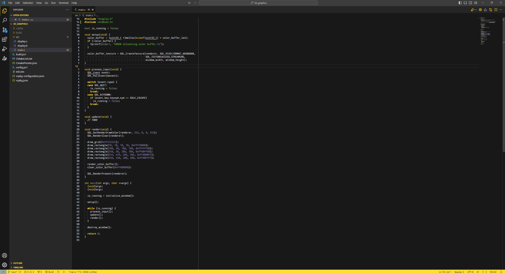

# Gruber Darker
Visual Studio Code version of the Gruber Darker theme made by Alexey Kutepov a.k.a. rexim a.k.a. Tsoding, based on the Gruber Dark theme for BBEdit by John Gruber.

This fork tries to reduce the number of different colors and uses yellow instead of green as the highlight color.

